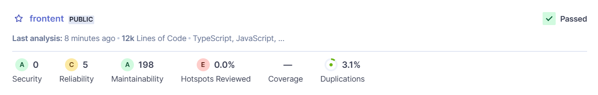

# ComptaCompanion

ComptaCompanion est une plateforme de chat en ligne qui permet d'accéder à des informations et des conseils sur la comptabilité et la finance de manière facile et rapide.

## Demo

Une version de production est accessible ici: [https://cc-front-prod.fly.dev/](https://cc-front-prod.fly.dev/).

## Fonctionnalités

| **Titre**                                  | **Description**                                                                                                                                                             |
|--------------------------------------------|-----------------------------------------------------------------------------------------------------------------------------------------------------------------------------|
| **Création de compte**                     | L’utilisateur a la possibilité de créer un compte pour accéder à l’application. Il peut utiliser son mail ou un service tiers.                                              |
| **Profils customisable**                   | L’utilisateur peut modifier ses informations ainsi que son statut (particulier, auto-entrepreneur)                                                                          |
| **Import de documents**                    | L’utilisateur peut importer ses documents, pour générer des rapports ou poser des questions dessus.                                                                         |
| **Choix du niveau de connaissance**        | L’utilisateur choisi le niveau de connaissance affilier au compte, cela permet d’avoir plus ou moins d’explications dans les réponses.                                      |
| **Questions prédéfinies**                  | L’utilisateur aura accès à de questions prédéfinie dans le chat par rapport aux choix de son profils                                                                        |
| **Questions sur documents**                | L’utilisateur peut poser des questions sur des documents fournis par nos soins (finances, comptabilité…)                                                                    |
| **Historique et gestion de conversations** | Mise en place d’un historique des conversations                                                                                                                             |
| **Scan de documents**                      | L’utilisateur a la possibilité d’importer et traiter des documents textuels tel que pdf, txt, md…                                                                           |
| **Dashboard et rapports personnalisés**    | L’utilisateur aura accès à un dashboard composé de rapports (synthèses, conseils et informations clés) sur les documents importés.                                          |
| **Exports de rapports**                    | Possibilité d’exporter des rapports du dashboard                                                                                                                            |

## Technologies utilisées

- Works across the entire [Next.js](https://nextjs.org) stack
  - App Router
  - Pages Router
  - Middleware
  - Client
  - Server
- supabase-ssr. A package to configure Supabase Auth to use cookies
- Stylisation avec [Tailwind CSS](https://tailwindcss.com)
- Composants de base faits avec [shadcn/ui](https://ui.shadcn.com/)
- Déploiement avec [Fly.io](https://fly.io/)


## Cloner et lancer localement
1. Vous aurez d'abord besoin d'un projet Supabase qui peut être créé [via le tableau de bord Supabase](https://database.new)
2. Créez une application Next.js en utilisant la commande npx du modèle Supabase Starter
   ```bash
   npx create-next-app -e with-supabase
   ```
3. Utilisez `cd` pour changer dans le répertoire de l'application
   ```bash

   The starter kit should now be running on [localhost:8080](http://localhost:8080/).

## Run app with docker

Build an image with the following command:

```sh
docker build -t esp_front .
```
And run the app:

```sh
docker run -p 8080:8080 --env-file .env -v $(pwd):/app esp_front
```

## Test the app with Cypress

1. Run the app locally

    ```sh
      bun run dev
    ```
2. Copy and rename `cypress.env.example.json` to  `cypress.env.json` and update the test data.

3. Run cypress directly in a browser:
```sh
  bun run cy:open
```
## Folder structure

- actions : supabase actions
- app : nextjs app
  - protected : protected routes
    - chat : chat routes
    - chat/[id] : chat routes
    - collections : collections routes
    - dashboard : dashboard routes
    - settings : settings routes
- components : shadcn components
- lib : supabase client
- utils : utils functions

## Lancement avec docker

```bash
  docker build -t esp_front .
  docker run -p 8080:8080 --env-file .env -v $(pwd):/app esp_front
```

Le kit de démarrage devrait maintenant fonctionner sur [localhost:8080](http://localhost:8080/).

## Structure du dépôt


```
├── actions : appels vers la base de données Supabase
├── app : dossier principal contenant les pages et les composants
│   ├── (auth-pages) : pages d'authentification
│   ├── api : API de l'application
│   ├── components : composants shadcn
│   ├── payment-success : paiement réussi
│   ├── privacy_policy : politique de confidentialité
│   ├── protected : pages protégées par authentification
│   │   ├── admin : gestion réservée aux administrateurs
│   │   ├── chat : regroupement de toutes les conversations
│   │   ├── confirm-payment : confirmation de paiement
│   │   ├── collections : page de gestion des collections de documents
│   │   ├── profile : profil de l'utilisateur
│   │   ├── report : génération de rapports pdf
│   │   ├── reset-password : réinitialisation du mot de passe
│   │   └── success : traitement de l'ajout de crédits
│   └── styles : styles additionnels
├── components : composants de l'application
├── content : contenu des conditions générales et de la politique de confidentialité
├── cypress : tests end-to-end
├── hooks : hooks personnalisés
├── lib : supabase client
├── sonar : documentation pour SonarQube
└── utils : fonctions utilitaires
```

## Résultats Analyse de Qualité SonarQube

